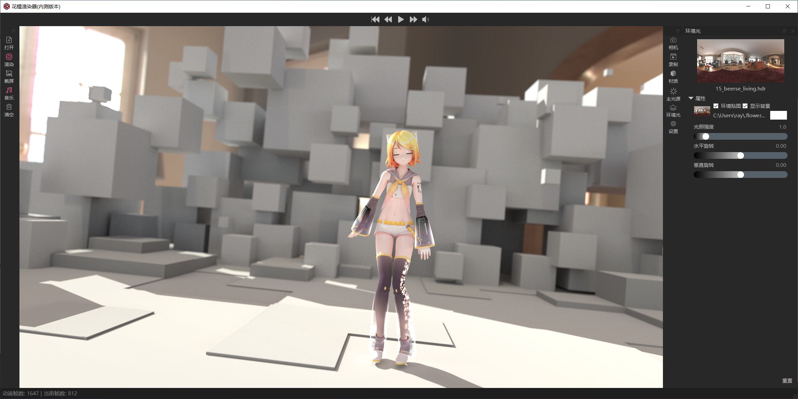
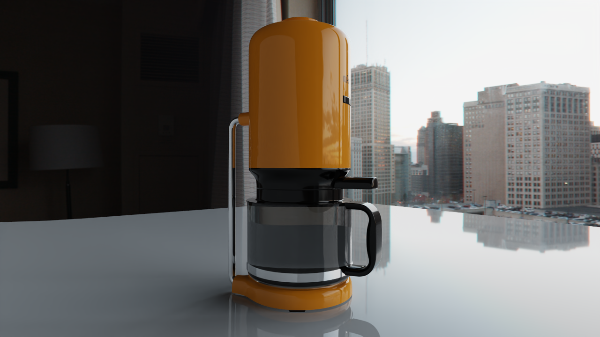
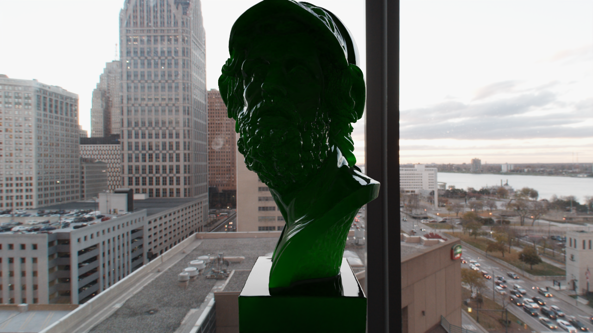
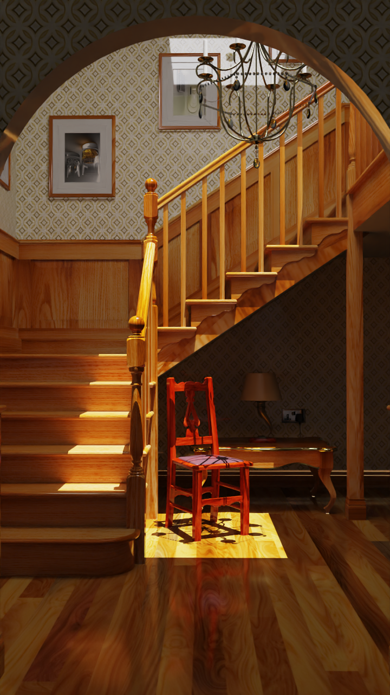

AnimatorGo
======
###### [English](https://github.com/ray-cast/flowers/blob/master/README_en.md) &nbsp; [中文](https://github.com/ray-cast/flowers/blob/master/README_en.md)
AnimatorGo是一个开源的商业动画渲染软件，本项目源码采用[知识共享署名-非商业性使用-相同方式共享 4.0 国际许可协议](http://creativecommons.org/licenses/by-nc-sa/4.0/)进行许可。提倡以简单、易用，高质量的物理演算以及渲染质量和性能。为喜爱二次元动画制作的爱好者降低视频制作门槛，用户可以轻松的迁移 [MikuMikuDance](http://www.geocities.jp/higuchuu4/index_e.htm) 的项目到本软件中制作成视频，同时编码为各大门户视频网站支持的视频编码格式。

AnimatorGo的图形核心提供了一个现代化和强大的ECS框架，使该项目开发变得简单。 系统以ECS的形式支持许多功能，如：前向和逆向运动学的骨骼动画，实时渲染，全局照明渲染器，AI降噪，物理演算，布料演算，音频播放和视频输出。 通过附加各种组件，对象可以灵活地执行不同的任务。 

AnimatorGo拥有一个快速高效的全局照明渲染器，基于分离内核架构以避免VGPR占用瓶颈，并广泛使用GPU优化的并行图元来重构工作，以更好地适应大规模并行GPU架构，渲染器是为渐进式预览设计的，具有同步性，允许在进行渲染时控制延迟并操纵场景和摄影机。 在所有供应商中保持着高水平的性能，全局照明渲染器使用OpenCL依赖于 AMD® [RadeonRays](https://github.com/GPUOpen-LibrariesAndSDKs/RadeonRays_SDK) 光线求交引擎，同时针对AMD®GPU和APU进行了优化。

AnimatorGo的多层材质描述基于双向散射分布函数（BSDF），能够很好的引入[NVIDIA's Material Definition Language](https://developer.nvidia.com/mdl-sdk)材质定义语言所带来的生态系统，如程序纹理，木材，织物，半透明塑料等。

特性：
------
* 完整的多层物理材质描述（金属，光滑，布料，清漆，次表面散射，自发光，等）
* 基于重要性采样的图像照明
* 物理的灯光单元
* 相机景深控制
* 多光源支持
* 基于物理的实时渲染
* 全局照明光线追踪渲染（OpenCL，[AMD® RadeonRays](https://github.com/GPUOpen-LibrariesAndSDKs/RadeonRays_SDK)）
* 基于深度学习的后处理降噪 ([Intel® Open Image Denoise](https://www.openimagedenoise.org/))
* 前向、逆向运动学的骨骼动画（Cyclic Coordinate Descent Method）
* 物理演算（PhysX）
* 布料演算（NVCloth）
* 模型文件支持（PMX、PMD，ABC）
* 动画文件支持（VMD）
* 场景文件支持（PMM）
* 视频编码（x264、x265）
* 图像文件（PNG、BMP、TGA、JPEG、DDS、HDR）
* 音频播放（OpenAL、Wav、Flac、Mp3、Ogg）
* 材质文件支持（[NVIDIA's Material Definition Language](https://developer.nvidia.com/mdl-sdk)）
* 基于Qt的图形界面

下载：
------
* https://github.com/ray-cast/flowers/releases/download/Alpha1.0.0/Demo.exe

编译依赖：
------
* Python 3.10.6 (64 bit)
* Conan Package Manager
* CMake 3.19.3
* Qt Linguist 5.12.0
* OpenCL SDK

系统需求：
------
1. 支持SSE4.1的CPU，如i5，用于AI 降噪
2. NVIDIA的独显用于GPGPU的光线追踪 
3. OpenCL 驱动 
4. Visual Studio 2019 Runtimes (软件根目录/_Redist/VC_redist.x64.exe)
6. 参与测试过的CPU，Intel i3, i5, i7, AMD 2600, 2600X
7. 参与测试过的显卡，GeFroce GTX 650, 1050, 1060, 2060

支持的编译器:
------
* Visual Studio 2017 (Only tested on 15.5.7 version)
* GNU GCC (Only tested on 5.4.0, 6.2.0, 7.3.0, 8.1.0 version)
* Clang & LLVM (Only tested on 5.0.0 version)
* Emscripten (Only tested on 1.37.40)
* Vcpkg (2020-11-1)

支持的平台:
------
* Windows (Only tested on XP, Vista, 7, 8, 10)
* Linux (Only tested on Ubuntu, Centos)
* HTML5
* Android (future)
* ios (Requires : automake autoconf)
* mac (future)

支持的渲染后端:
------
* OpenGL 330
* OpenGL 450
* OpenGL ES 2.0
* OpenGL ES 3.0
* OpenGL ES 3.2