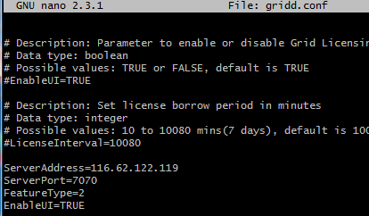
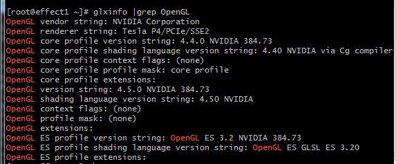
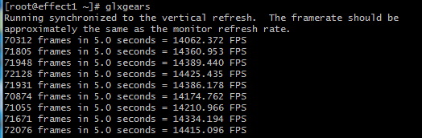

创建 gn5i 实例 并且安装 GRID 驱动
----------------------

#### 创建 gn5i 规格族实例
------------
1. 选择实例配置时，网络：选择 专有网，gn5i 实例只支持专有网络。
2. 在镜像市场选择 CentOS 7.3 并且预装 NVIDIA GPU 驱动  

#### SSH远程链接
------------
1. 将服务器的私钥文件`sjg_effect`重命名为`id_ras`
2. 剪切`id_ras`到`win`下的`C:\Users\Administrator`目录
3. 从 https://git-scm.com/ 官网下载 `git` 安装到任意目录
4. 启动 `git-bash`
5. 运行以下指令添加私钥文件
    ```
    ssh-agent bash
    ssh-add id_ras
    ```
6. 出现`Enter passphrase for id_ras:` 则输入服务器的私钥密码
7. 使用`ssh root@ip-address` 连接远端服务器

#### 安装桌面环境
------------
1. 使用SSH远程连接CentOS服务器  
2. 依次运行以下命令升级系统并安装KDE桌面  
	```
	yum update
	yum install kernel-devel
	yum groupinstall "Development Tools"
	yum groupinstall "KDE Plasma Workspaces"
	```
3. 运行`reboot`重启系统  

#### 安装NVIDIA GRID驱动包
------------
1. 使用SSH远程连接CentOS服务器  
2. 按以下操作关闭默认的nouveau驱动  
  * 运行 `vim /etc/modprobe.d/blacklist.conf` 添加以下内容
	```
	blacklist nouveau
	```

  * 运行 `vim /lib/modprobe.d/dist-blacklist.conf`，添加以下内容
	```
	blacklist nouveau
	options nouveau modeset=0
	```

  * 运行 `mv /boot/initramfs-$(uname -r).img /boot/initramfs-$(uname -r)-nouveau.img`
  * 运行 `dracut /boot/initramfs-$(uname -r).img $(uname -r)`
  * 运行 `reboot` 重启系统  
3. 下载NVIDIA GRID驱动包
	```
	wget https://griddownloads.nvidia.com/flex/GRID5.0/NVIDIA-GRID-RHEL-7-384.73-385.41.zip
	```
4. 运行以下命令解压NVIDIA GRID驱动包  
	```
	unzip NVIDIA-GRID-RHEL-7-384.73-385.41.zip
	```
5. 运行以下命令，安装NVIDIA GRID驱动  
	```
	chmod 777 NVIDIA-Linux-x86_64-384.73-grid.run
	./NVIDIA-Linux-x86_64-384.73-grid.run
	```
6. 运行命令 `nvidia-smi` 测试驱动是否安装成功, 如果返回以下类似结果，说明驱动已经成功安装  


7. 运行 `nvidia-xconfig --enable-all-gpus --separate-x-screens`
8. 运行命令 `lspci | grep NVIDIA` 查询GPU BusID， 本例 GPU BusID 为 00:07.0  
	
9. 编辑 `/etc/X11/xorg.conf`，在 `Section "Device"` 段添加 BusID，如本示例中为 BusID "PCI:0:7:0"  
    
10. 运行以下指令删除多余文件
    ```
    rm -rf 384.73-385.41-grid-gpumodeswitch-user-guide.pdf
    rm -rf 384.73-385.41-grid-license-server-release-notes.pdf
    rm -rf 384.73-385.41-grid-license-server-user-guide.pdf
    rm -rf 384.73-385.41-grid-licensing-user-guide.pdf
    rm -rf 384.73-385.41-grid-software-quick-start-guide.pdf
    rm -rf 384.73-385.41-grid-vgpu-release-notes-red-hat-el-kvm.pdf
    rm -rf 385.41_grid_win10_32bit_international.exe
    rm -rf 385.41_grid_win10_server2016_64bit_international.exe
    rm -rf 385.41_grid_win8_win7_32bit_international.exe
    rm -rf 385.41_grid_win8_win7_server2012R2_server2008R2_64bit_international.exe
    rm -rf NVIDIA-GRID-RHEL-7-384.73-385.41.zip
    rm -rf NVIDIA-Linux-x86_64-384.73-grid.run
    ```
11. 运行 `reboot` 重启服务器

### 激活NVIDIA GRID协议(可选)
------------
  * 因为NVIDIA协议的而限制部分特性，可以按以下步骤添加License Server，激活License
  1. 运行 `cd /etc/nvidia` 切换到/etc/nvidia
  2. 运行 `cp gridd.conf.template gridd.conf` 建立gridd.conf文件
  3. 运行 `vim gridd.conf` 文件末尾添加如下所示的License Server信息：
	```
	ServerAddress=替换成服务器IP地址(example: 116.62.19.179)
	ServerPort=7070
	FeatureType=2
	EnableUI=TRUE
	```  
	
  4. 运行 `reboot` 重启服务器
  
### 配置X-Server环境
------------
1. 使用SSH远程连接CentOS服务器
2. 运行 `cd /etc/rc.d/init.d` 切换到 /etc/rc.d/init.d 目录
3. 运行 `touch startx.sh` 建立 startx.sh 文件
4. 运行 `vim startx.sh` 添加以下内容到文件
	```
	#!/bin/sh
	#chkconfig: 2345 80 90
	#description: x-server setup

	startx &
	```
5. 运行 `chmod 777 /etc/init.d/startx.sh` 赋予可读可写可执行权限
6. 运行 `chkconfig --add startx.sh` 添加startx.sh 到服务
7. 运行 `​chkconfig --level 2345 startx.sh on` 允许在level=2,3,4,5下启动
8. 运行 `vim /etc/profile` 在文件末尾处添加以下内容
    ```
    export DISPLAY=":0"
    ```
9. 运行 `vim /etc/inittab` 文件中的 `id:3:initdefault` 将3改为5，如果没有则末尾添加 `id:5:initdefault`  

10. 运行 `reboot` 重启服务器
11. 再次SSH远程连接CentOS服务器
12. 运行命令 `nvidia-smi` 查看进程是否存在X-Server  


### 配置 OpenGL 环境
----------------
1. 使用SSH远程连接CentOS服务器
2. 依次运行如下安装OpenGL依赖库
	```
	yum install mesa*
	yum install libX11.x86_64
	yum install libXi.x86_64
	yum install libXrandr.x86_64
	yum install libXcursor.x86_64
	yum install glx-utils.x86_64
	```
3. 运行 `glxinfo |grep OpenGL`查询OpenGL是否支持,如果出现如下图所示的窗口，表明GRID驱动正常工作。
		
4. 运行 `glxgears` 查看是否可以启动OpenGL实例, 按下`ctrl` + `Pause Break`可以终止  
	
### 安装 GCC
----------------
1. 使用SSH远程连接CentOS服务器
2. 下载GCC 6.2.0
	```
	wget http://ftp.gnu.org/gnu/gcc/gcc-6.2.0/gcc-6.2.0.tar.gz
	```
3. 运行 `tar zxvf gcc-6.2.0.tar.gz` 解压
4. 运行 `cd gcc-6.2.0` 切换到 gcc-6.2.0 目录
5. 运行 `./contrib/download_prerequisits` 下载依赖库
6. 运行 `mkdir build` 建立build目录
7. 运行 `cd build` 切换到 build 目录
8. 运行 `../configure –-disable-multilib` 生成 Makefile
9. 运行 `make`
10. 运行 `make install`
11. 运行 `vim /etc/profile` 添加以下内容到文件
	```
	export CC="/usr/local/bin/gcc"
	export CXX="/usr/local/bin/g++"
	```
12. 使用 `gcc -v` 查看版本号是否为 `gcc version 6.2.0 (GCC)`
13. 运行 `rm -rf gcc-6.2.0` 删除多余文件